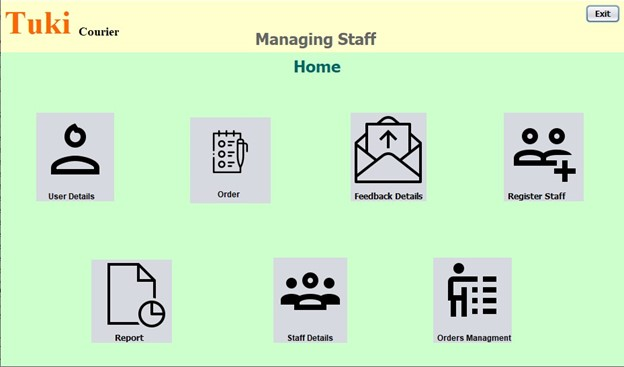
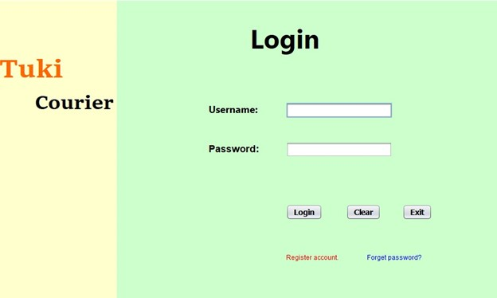
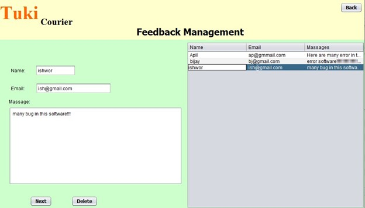

Sample Output 
 
Figure 1: Main menu of Tuki Courier
Above interface is the main menu of the courier system. There are three actors on this menu i.e. Customer, delivery staff and Admin. All these three actors have to enter predefined user ID and password in order to have access to their corresponding page.
 
 
Figure 2: Login page of Managing staff

Above interface shows the login page of Managing staff. Managing staff have to enter the predefined username and password in order to have various access like manage order, register user, delete user, assigned delivery.

  
Figure 3: Homepage of Managing staff

This interface will appear after the managing staff enter correct username and password that is already being defined in the system. In this section the managing staff will be able to view, update or register user, manage and place order, register staff in the system, view and respond feedback from the customer. Managing staff of the company will only have access to this panel.

   
Figure 4:  Costumer detail management

Above interface shows the list of customers and their information that are registered in the system. In this panel managing staff can edit or delete the customer information.

   
Figure 5: Delivery staff management

Above interface shows the page for managing delivery staff working in the company.
 

  
Figure 6: Customer login page

Above interface shows the login interface of the customer. Customer can login with predefined user name and password to have access like edit their personal information, give feedback.

   
Figure 7: Feedback Management

Above interface shows the feedback management panel where managing staff can view and delete the feedback received from the customer.

   
Figure 8: Staff login

Above interface shows the login panel of staff working in the company

   
Figure 9: Error
Above interface shows the error when undefined username or password is entered in the system. This prevent unauthorized access to the system. Error message is displayed when wrong user name or password is entered either in managing staff login, staff login or customer login.

   
Figure 10: Placing order

Above interface shows the take order section. Managing system of the company will have access to this page and place the order feeling all the information received from the customer.
 
   
Figure 11: Order Management

Above interface shows the order management panel where managing staff can view, update and delete the order placed in the system.
